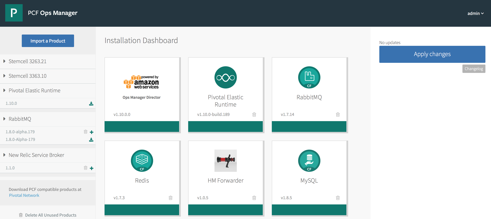
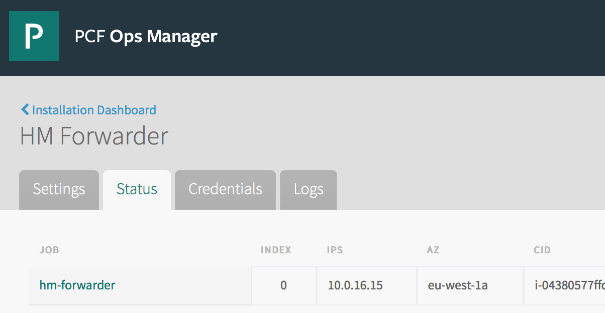
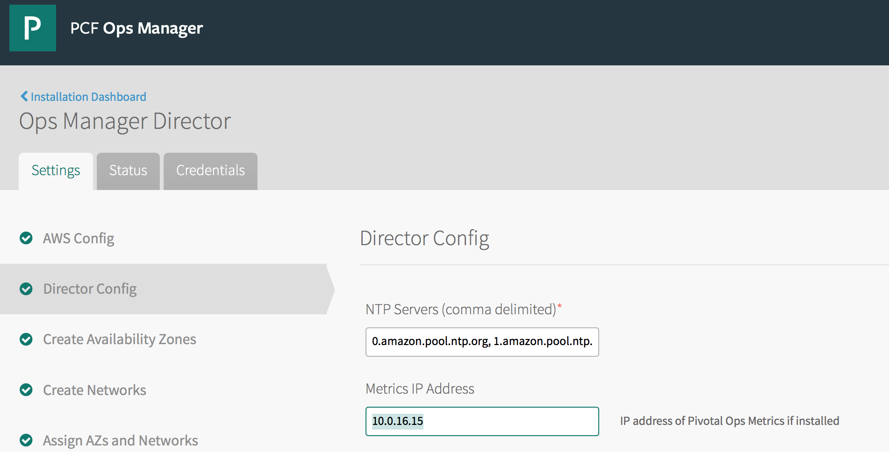

# BOSH HM Forwarder

This project is a fork to update to PCF 1.10

## How to build

Use `build.sh` assuming you build with docker

Docs: https://docs.pivotal.io/tiledev/tile-generator.html

## Tested with

PCF 1.10

## How to test

Once deployed, note the forwarder IP address from the `OpsManager tile Status` tab.



Use this IP address for the `OpsManager director tile, under `Director config / Metrics IP Address`



Once done, you can check with
`cf nozzle`
and should see the bosh-hm-forwarder


## Examples

```
origin:"bosh-hm-forwarder" eventType:ValueMetric timestamp:1490565611000000000 deployment:"cf-44a2b320725d9804f29e" job:"diego_cell" index:"0" ip:"" valueMetric:<name:"system.load.1m" value:0.03 unit:"Load" >
origin:"bosh-hm-forwarder" eventType:ValueMetric timestamp:1490565611000000000 deployment:"cf-44a2b320725d9804f29e" job:"diego_cell" index:"0" ip:"" valueMetric:<name:"system.cpu.user" value:2.1 unit:"Load" >
origin:"bosh-hm-forwarder" eventType:ValueMetric timestamp:1490565611000000000 deployment:"cf-44a2b320725d9804f29e" job:"diego_cell" index:"0" ip:"" valueMetric:<name:"system.mem.percent" value:14 unit:"Percent" >
origin:"bosh-hm-forwarder" eventType:ValueMetric timestamp:1490565611000000000 deployment:"cf-44a2b320725d9804f29e" job:"diego_cell" index:"0" ip:"" valueMetric:<name:"system.cpu.sys" value:1.5 unit:"Load" >
origin:"bosh-hm-forwarder" eventType:ValueMetric timestamp:1490565611000000000 deployment:"cf-44a2b320725d9804f29e" job:"diego_cell" index:"0" ip:"" valueMetric:<name:"system.cpu.wait" value:0.1 unit:"Load" >
origin:"bosh-hm-forwarder" eventType:ValueMetric timestamp:1490565611000000000 deployment:"cf-44a2b320725d9804f29e" job:"diego_cell" index:"0" ip:"" valueMetric:<name:"system.disk.system.percent" value:36 unit:"Percent" >
origin:"bosh-hm-forwarder" eventType:ValueMetric timestamp:1490565611000000000 deployment:"cf-44a2b320725d9804f29e" job:"diego_cell" index:"0" ip:"" valueMetric:<name:"system.swap.percent" value:0 unit:"Percent" >
origin:"bosh-hm-forwarder" eventType:ValueMetric timestamp:1490565611000000000 deployment:"cf-44a2b320725d9804f29e" job:"diego_cell" index:"0" ip:"" valueMetric:<name:"system.mem.kb" value:4.340768e+06 unit:"Kb" >
origin:"bosh-hm-forwarder" eventType:ValueMetric timestamp:1490565611000000000 deployment:"cf-44a2b320725d9804f29e" job:"diego_cell" index:"0" ip:"" valueMetric:<name:"system.swap.kb" value:0 unit:"Kb" >
origin:"bosh-hm-forwarder" eventType:ValueMetric timestamp:1490565611000000000 deployment:"cf-44a2b320725d9804f29e" job:"diego_cell" index:"0" ip:"" valueMetric:<name:"system.disk.ephemeral.inode_percent" value:2 unit:"Percent" >
origin:"bosh-hm-forwarder" eventType:ValueMetric timestamp:1490565611000000000 deployment:"cf-44a2b320725d9804f29e" job:"diego_cell" index:"0" ip:"" valueMetric:<name:"system.healthy" value:1 unit:"b" >
origin:"bosh-hm-forwarder" eventType:ValueMetric timestamp:1490565611000000000 deployment:"cf-44a2b320725d9804f29e" job:"diego_cell" index:"0" ip:"" valueMetric:<name:"system.disk.system.inode_percent" value:30 unit:"Percent" >
origin:"bosh-hm-forwarder" eventType:ValueMetric timestamp:1490565611000000000 deployment:"cf-44a2b320725d9804f29e" job:"diego_cell" index:"0" ip:"" valueMetric:<name:"system.disk.ephemeral.percent" value:8 unit:"Percent" >
``` 
